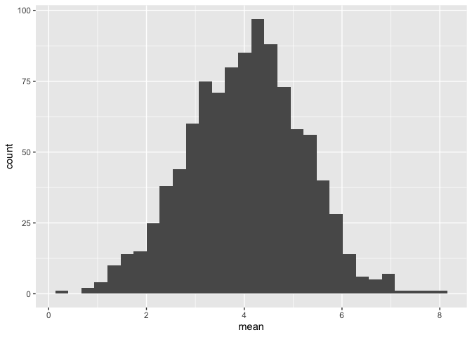
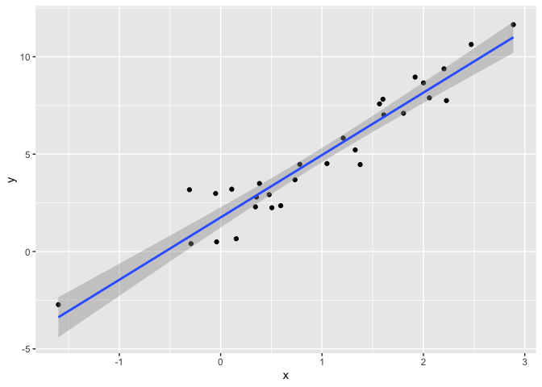
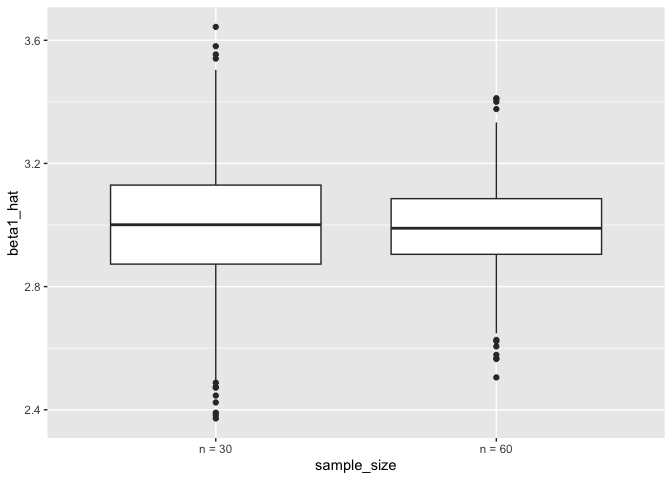
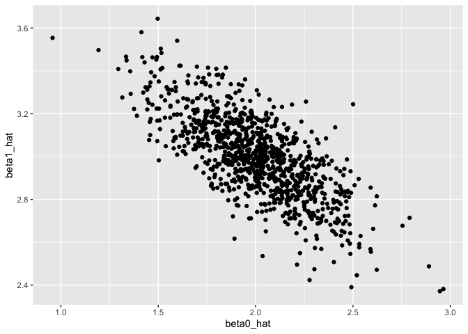
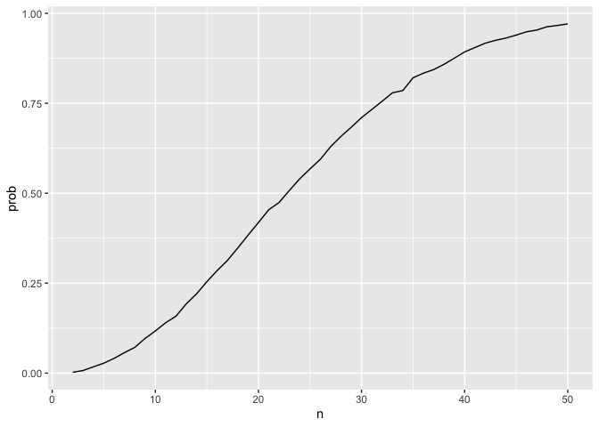

simulations
================
Mahdi Maktabi
2024-10-31

``` r
x_vec = rnorm(n = 25, mean = 10, sd = 3.5)

(x_vec - mean(x_vec)) / sd(x_vec)
```

``` r
z_scores = function(x) {
  
  if (!is.numeric(x)) {
    stop("Argument x should be numeric")
  } else if (length(x) == 1) {
    stop("Z scores cannot be computed for length 1 vectors")
  }
  
  z = mean(x) / sd(x)
  
  z
}
```

``` r
mean_and_sd = function(x) {
  
  mean_x = mean(x)
  sd_x = sd(x)
  
  out_df =
    tibble(
      mean = mean_x,
      sd = sd_x
    )
  
  return(out_df)
  
}

mean_and_sd(x_vec)
```

    ## Error: object 'x_vec' not found

## Check stuff using a simulation

``` r
sim_df =
  tibble(
    x = rnorm(30, 10, 5)
  )

sim_df |> 
  summarize(
    mean = mean(x),
    sd = sd(x)
  )
```

    ## # A tibble: 1 × 2
    ##    mean    sd
    ##   <dbl> <dbl>
    ## 1  10.9  5.62

Simulation function to check sample mean and sd.

``` r
sim_mean_sd = function(samp_size, true_mean = 4, true_sd = 12) {
  
  sim_df =
  tibble(
    x = rnorm(samp_size, true_mean, true_sd)
  )

  out_df = 
    sim_df |> 
    summarize(
      mean = mean(x),
      sd = sd(x)
  )
  
  return(out_df)
  
}

sim_mean_sd(samp_size = 30, true_mean = 4, true_sd = 12)
```

    ## # A tibble: 1 × 2
    ##    mean    sd
    ##   <dbl> <dbl>
    ## 1  5.13  14.0

``` r
sim_mean_sd(true_mean = 4, true_sd = 12, samp_size = 30)
```

    ## # A tibble: 1 × 2
    ##    mean    sd
    ##   <dbl> <dbl>
    ## 1  5.61  14.8

Run this a lot of times …

``` r
sim_mean_sd(30)
```

    ## # A tibble: 1 × 2
    ##    mean    sd
    ##   <dbl> <dbl>
    ## 1  4.47  12.1

run this using a for loop?

``` r
output = vector("list", 1000)

for (i in 1:1000) {
  
  output[[i]] = sim_mean_sd(30)
}

#output


bind_rows(output) |> 
  summarize(
    ave_mean = mean(mean),
    sd_mean = sd(mean))
```

    ## # A tibble: 1 × 2
    ##   ave_mean sd_mean
    ##      <dbl>   <dbl>
    ## 1     4.08    2.22

Can I use `map` instead?

``` r
sim_res =
  tibble(
    iter = 1:1000
  ) |> 
  mutate(samp_res = map(iter, sim_mean_sd, samp_size = 30)) |> 
  unnest(samp_res)
```

Could I try different sample sizes?

``` r
sim_res =
  expand_grid(
    n = c(10, 30, 60, 100),
    iter = 1:1000
  ) |> 
  mutate(samp_res = map(n, sim_mean_sd)) |> 
  unnest(samp_res)
```

``` r
sim_res |> 
  group_by(n) |> 
  summarize(
    se = sd(mean)
  )
```

    ## # A tibble: 4 × 2
    ##       n    se
    ##   <dbl> <dbl>
    ## 1    10  3.77
    ## 2    30  2.18
    ## 3    60  1.50
    ## 4   100  1.23

``` r
sim_res |> 
  filter(n == 100) |> 
  ggplot(aes(x = mean)) +
  geom_histogram()
```

    ## `stat_bin()` using `bins = 30`. Pick better value with `binwidth`.

<!-- -->

## Simple Linear Regression

``` r
sim_data = 
  tibble(
    x = rnorm(30, mean = 1, sd = 1),
    y = 2+3*x + rnorm(30, 0, 1)
  ) 

lm_fit = lm(y ~ x, data = sim_data)

sim_data |> 
  ggplot(aes(x = x, y = y)) + 
  geom_point() +
  stat_smooth(method = "lm")
```

    ## `geom_smooth()` using formula = 'y ~ x'

<!-- -->

Turn this into a function

``` r
sim_regression = function(n) {
  
  sim_data = 
    tibble(
      x = rnorm(n, mean = 1, sd = 1),
      y = 2+3*x + rnorm(n, 0, 1)
    ) 

  lm_fit = lm(y ~ x, data = sim_data)
  
  out_df =
    tibble(
      beta0_hat = coef(lm_fit)[1],
      beta1_hat = coef(lm_fit)[2]
    )
  
  return(out_df)
  
}

sim_res =
  expand_grid(
    sample_size = c(30, 60),
    iter = 1:1000
  ) |> 
mutate(lm_res = map(sample_size, sim_regression)) |> 
  unnest(lm_res)

sim_res |> 
  mutate(sample_size = str_c("n = ", sample_size)) |> 
  ggplot(aes(x = sample_size, y = beta1_hat)) +
  geom_boxplot()
```

<!-- -->

``` r
sim_res |> 
  filter(sample_size == 30) |> 
  ggplot(aes(x = beta0_hat, y = beta1_hat)) +
  geom_point()
```

<!-- -->

## Birthday problem!!

Lets put people in a room and see how many have the same birthday.

``` r
bday_sim = function(n) {
  
  bdays = sample(1:365, size = n, replace = TRUE)

  duplicate = length(unique(bdays)) < n

  return(duplicate)
  
}

bday_sim(10)
```

    ## [1] FALSE

Going to run this above alot.

``` r
sim_res =
  expand_grid(
    n = 2:50,
    iter = 1:10000
  ) |> 
  mutate(res = map_lgl(n, bday_sim)) |> 
  group_by(n) |> 
  summarize(prob = mean(res))

sim_res |> 
  ggplot(aes(x = n, y = prob)) +
  geom_line()
```

<!-- -->
